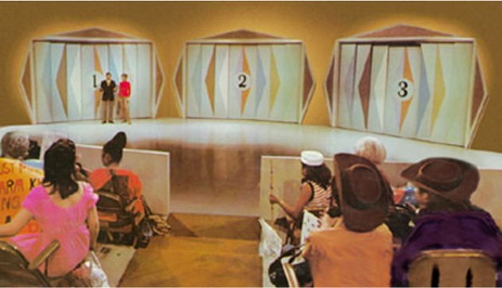

```{r setup, include=FALSE}
knitr::opts_chunk$set(echo = TRUE, warning = FALSE, message = FALSE, fig.align="center")
```

## About Let's Make a Deal

Let’s Make a Deal was a game show hosted by Monty Hall and Carol Merril. It originally ran from 1963 to 1977 on network TV. The highlight of the show was the “Big Deal,” where contestants would trade previous winnings for the chance to choose one of three doors and take whatever was behind it--maybe a car, maybe livestock.

## Let's Play Let's Make a Deal! 

You are now a contestant on Let’s Make a Deal. You will choose one of three doors: the grand prize is behind one of the doors; the other doors hide silly consolation gifts which Monty called “zonks.”



You choose a door. Monty reveals a zonk behind one of the other doors. He then gives you the option of switching doors or 
sticking with your original choice… **Do you want to switch doors?**

Let's explore the answer to this questions using simulation in R!

```{r libraries}
library(tidyverse)
library(magrittr)
library(ggplot2)
library(ggtext)
```

```{r simulateMontyHall}
## Set the number of simulations to perform
n <- 1000

## Randomly select the door with the prize behind it
prizeDoor <- sample(1:3, n, replace = TRUE)

## Randomly determine the contestant's door choice. If the contestant decides to stay, this will be their door
chosenDoor <- sample(1:3, n, replace = TRUE)
doors <- data.frame(prizeDoor, chosenDoor)

## Determine the door Monty Hall will reveal. 
host_selection <- function(doorsInPlay) {
  
    doorsInPlay %<>% unique()
    availableZonkDoors <- c(1:3)[-doorsInPlay]
## If the contestant selected a zonk door, there is only one more zonk to reveal.
    if (length(availableZonkDoors) == 1) {  
      return(availableZonkDoors)
## If the contestant selected the prize door, there are two zonks to reveal.
    } else { 
        return(sample(availableZonkDoors,1))
      }
}
 
doors$revealedDoor <- apply(doors, FUN=host_selection, MARGIN=1)

## Doors 1,2,3 should add up to 6, let's use this to determine the remaining door number
doors %<>% mutate(otherDoor = 6 - (chosenDoor + revealedDoor),
                  switchWins = ifelse(otherDoor == prizeDoor, 1, 0),
                  stayWins = ifelse(chosenDoor == prizeDoor, 1, 0))

## Proportion of wins
switchPercent <- mean(doors$switchWins)
stayPercent <- mean(doors$stayWins)

## If you choose to stay, the probability of winning is
stayPercent

## If you choose to switch, the probability of winning is
switchPercent

```

Is this the result you expected? 

Let's take a closer look at these trials to see the convergence to the true winning proportions for each option:

```{r}
## Plot 'convergence' to true winning proportions
## Blue is switching doors, red is staying

doors$index <- 1:n
ggplot(doors) +
  geom_line(aes(x = index, y = cumsum(switchWins)/c(1:n)), color = "orange", alpha = 0.7, size = 1.2) +
  geom_line(aes(x = index, y = cumsum(stayWins)/c(1:n)), color = "darkcyan", alpha = 0.7, size = 1.2) +
  # geom_line(alpha = 0.7, size = 1.5) +
    labs(
    title = "Monty Hall: Let's Make a Deal         
    <span style='font-size:11pt'> <span style='color:darkorange;'>Switching Doors</span> vs
    <span style='color:darkcyan;'>Staying</span>
    </span>",
    x = "Number of Trials",
    y = "Percent of Trials Won"
)+
  theme_minimal()  +
  theme(legend.title=element_blank()) +
  theme(
    plot.title = element_markdown(lineheight = 1.1)
  )

```